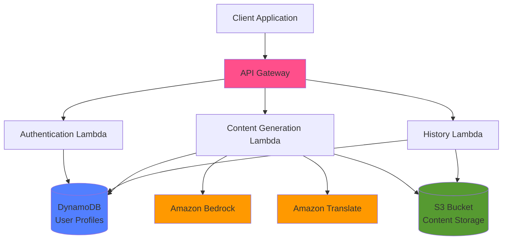

# Design Document: Bharat Content AI

## Overview

Bharat Content AI is a serverless, AI-driven content generation platform built on AWS services. The architecture follows a microservices pattern with API Gateway as the entry point, Lambda functions for business logic, Amazon Bedrock for AI content generation, DynamoDB for user data, S3 for content storage, and Amazon Translate for multilingual support.

The system accepts a single content input and generates multiple platform-specific outputs (Instagram, LinkedIn, Twitter, blog, YouTube) with optional translation to Indian regional languages, hashtag recommendations, and engagement predictions.

## Architecture

### High-Level Architecture



### Component Responsibilities

1. **API Gateway**: Request routing, authentication, rate limiting, request validation
2. **Authentication Lambda**: User registration, login, token management
3. **Content Generation Lambda**: Orchestrates AI generation, translation, hashtag generation, engagement prediction
4. **History Lambda**: Retrieves and manages user content history
5. **Amazon Bedrock**: Generates content using foundation models (Claude, Titan, etc.)
6. **Amazon Translate**: Translates content to regional languages
7. **DynamoDB**: Stores user profiles, preferences, and metadata
8. **S3**: Stores generated content with encryption

## Components and Interfaces

### 1. API Gateway

**Endpoints:**

```
POST   /auth/register
POST   /auth/login
POST   /content/generate
GET    /content/history
DELETE /content/{contentId}
PUT    /user/profile
GET    /user/profile
```

**Request/Response Formats:**

```typescript
// POST /content/generate
Request: {
  contentInput: string;
  targetLanguage?: string; // 'en' | 'hi' | 'ta' | 'te' | 'bn' | 'mr'
  formats: string[]; // ['instagram', 'linkedin', 'twitter', 'blog', 'youtube']
}

Response: {
  contentId: string;
  generatedContent: {
    instagram?: GeneratedContent;
    linkedin?: GeneratedContent;
    twitter?: GeneratedContent;
    blog?: GeneratedContent;
    youtube?: GeneratedContent;
  };
  hashtags: {
    instagram?: string[];
    linkedin?: string[];
    twitter?: string[];
  };
  engagementPredictions: {
    [format: string]: EngagementMetrics;
  };
  optimizationSuggestions: OptimizationSuggestion[];
}

type GeneratedContent = {
  text: string;
  language: string;
  characterCount: number;
  readabilityScore: number;
}

type EngagementMetrics = {
  estimatedLikes: number;
  estimatedShares: number;
  estimatedComments: number;
  confidenceScore: number;
}

type OptimizationSuggestion = {
  type: 'readability' | 'length' | 'tone' | 'timing';
  message: string;
  reasoning: string;
}
```

**Rate Limiting:**
- 100 requests per minute per user
- Implemented using API Gateway throttling with burst capacity of 200

**Authentication:**
- JWT tokens with 24-hour expiration
- Token passed in Authorization header: `Bearer <token>`

### 2. Content Generation Lambda

**Responsibilities:**
- Orchestrate content generation workflow
- Call Amazon Bedrock for AI generation
- Call Amazon Translate for multilingual support
- Generate hashtags using AI
- Predict engagement metrics
- Provide optimization suggestions
- Store results in S3 and metadata in DynamoDB

**Workflow:**

```
1. Validate input (length >= 10 characters)
2. For each requested format:
   a. Generate platform-specific prompt
   b. Call Bedrock to generate content
   c. If target language != 'en', translate using Amazon Translate
   d. Calculate readability score
3. Generate hashtags for social formats
4. Predict engagement metrics
5. Generate optimization suggestions
6. Store content in S3
7. Store metadata in DynamoDB
8. Return response
```

**Bedrock Integration:**

```python
# Prompt template for each platform
PLATFORM_PROMPTS = {
    'instagram': """
        Create an engaging Instagram post based on this content: {input}
        
        Requirements:
        - Maximum 2200 characters
        - Include emoji where appropriate
        - Engaging and visual language
        - Call-to-action at the end
        - Conversational tone
    """,
    
    'linkedin': """
        Create a professional LinkedIn post based on this content: {input}
        
        Requirements:
        - Maximum 3000 characters
        - Professional tone
        - Industry insights
        - Value-driven content
        - Thought leadership angle
    """,
    
    'twitter': """
        Create a Twitter thread based on this content: {input}
        
        Requirements:
        - Break into tweets of max 280 characters each
        - Number each tweet (1/n format)
        - Hook in first tweet
        - Clear narrative flow
        - Engaging and concise
    """,
    
    'blog': """
        Create a blog summary based on this content: {input}
        
        Requirements:
        - 150-300 words
        - Clear introduction
        - Key points highlighted
        - Conclusion with takeaway
        - SEO-friendly language
    """,
    
    'youtube': """
        Create a YouTube video description based on this content: {input}
        
        Requirements:
        - 200-500 words
        - Engaging opening
        - Timestamp suggestions
        - Call-to-action
        - Related keywords
    """
}
```

### 3. Hashtag Recommender

**Algorithm:**

```
1. Extract key topics from generated content using Bedrock
2. Generate candidate hashtags based on topics
3. For regional languages, generate both native and English hashtags
4. Rank hashtags by:
   - Relevance to content (0-1 score)
   - Popularity (trending score)
   - Specificity (niche vs broad)
5. Return top N hashtags based on platform:
   - Instagram: 10-30 hashtags
   - Twitter: 3-5 hashtags
   - LinkedIn: 3-5 hashtags
```

**Implementation:**

```python
def generate_hashtags(content: str, platform: str, language: str) -> list[str]:
    # Use Bedrock to extract topics
    prompt = f"""
    Analyze this content and extract 5-10 key topics or themes:
    {content}
    
    Return only the topics as a comma-separated list.
    """
    
    topics = call_bedrock(prompt).split(',')
    
    # Generate hashtags from topics
    hashtag_prompt = f"""
    Generate relevant hashtags for {platform} based on these topics: {topics}
    
    Requirements:
    - Return {get_hashtag_count(platform)} hashtags
    - Mix of popular and niche hashtags
    - Relevant to the content
    - Format: #hashtag (one per line)
    """
    
    hashtags = call_bedrock(hashtag_prompt).split('\n')
    
    # If regional language, add English equivalents
    if language != 'en':
        english_hashtags = translate_hashtags(hashtags, language, 'en')
        hashtags.extend(english_hashtags)
    
    return rank_and_filter(hashtags, platform)
```

### 4. Engagement Predictor

**Prediction Model:**

The engagement predictor uses a combination of content features and historical data to estimate engagement metrics.

**Features:**
- Content length
- Readability score
- Sentiment score
- Topic relevance
- Hashtag quality
- User's historical performance (if available)
- Platform-specific factors

**Implementation:**

```python
def predict_engagement(
    content: str,
    platform: str,
    user_history: dict | None
) -> EngagementMetrics:
    
    # Extract content features
    features = {
        'length': len(content),
        'readability': calculate_readability(content),
        'sentiment': analyze_sentiment(content),
        'has_cta': has_call_to_action(content),
        'emoji_count': count_emojis(content)
    }
    
    # Base predictions (platform averages)
    base_metrics = get_platform_baselines(platform)
    
    # Adjust based on content features
    multiplier = calculate_feature_multiplier(features)
    
    # Incorporate user history if available
    if user_history:
        historical_multiplier = calculate_historical_multiplier(
            user_history, platform
        )
        multiplier *= historical_multiplier
        confidence = 0.7  # Higher confidence with history
    else:
        confidence = 0.4  # Lower confidence without history
    
    return EngagementMetrics(
        estimatedLikes=int(base_metrics['likes'] * multiplier),
        estimatedShares=int(base_metrics['shares'] * multiplier),
        estimatedComments=int(base_metrics['comments'] * multiplier),
        confidenceScore=confidence
    )

def get_platform_baselines(platform: str) -> dict:
    # Industry average engagement rates
    baselines = {
        'instagram': {'likes': 100, 'shares': 10, 'comments': 15},
        'linkedin': {'likes': 50, 'shares': 20, 'comments': 8},
        'twitter': {'likes': 80, 'shares': 30, 'comments': 5},
        'blog': {'likes': 40, 'shares': 15, 'comments': 10},
        'youtube': {'likes': 200, 'shares': 50, 'comments': 25}
    }
    return baselines.get(platform, baselines['instagram'])
```

### 5. Content Optimizer

**Optimization Checks:**

```python
def generate_optimization_suggestions(
    content: str,
    platform: str,
    engagement_prediction: EngagementMetrics
) -> list[OptimizationSuggestion]:
    
    suggestions = []
    
    # Readability check
    readability = calculate_readability(content)
    if readability < 60:
        suggestions.append(OptimizationSuggestion(
            type='readability',
            message='Consider simplifying language for better readability',
            reasoning=f'Current readability score: {readability}/100. Aim for 60+'
        ))
    
    # Length check
    char_count = len(content)
    limits = get_platform_limits(platform)
    if char_count > limits['max']:
        suggestions.append(OptimizationSuggestion(
            type='length',
            message=f'Content exceeds {platform} limit by {char_count - limits["max"]} characters',
            reasoning='Trim content to fit platform requirements'
        ))
    elif char_count < limits['optimal_min']:
        suggestions.append(OptimizationSuggestion(
            type='length',
            message=f'Content is shorter than optimal length for {platform}',
            reasoning=f'Consider expanding to {limits["optimal_min"]}-{limits["optimal_max"]} characters'
        ))
    
    # Emotional appeal check
    sentiment = analyze_sentiment(content)
    if abs(sentiment) < 0.2:  # Neutral content
        suggestions.append(OptimizationSuggestion(
            type='tone',
            message='Content lacks emotional appeal',
            reasoning='Add emotional elements to increase engagement'
        ))
    
    # Timing suggestion
    optimal_time = get_optimal_posting_time(platform)
    suggestions.append(OptimizationSuggestion(
        type='timing',
        message=f'Best time to post on {platform}: {optimal_time}',
        reasoning='Based on platform engagement patterns'
    ))
    
    return suggestions

def calculate_readability(text: str) -> float:
    # Flesch Reading Ease score
    # Higher score = easier to read (0-100 scale)
    sentences = text.count('.') + text.count('!') + text.count('?')
    words = len(text.split())
    syllables = count_syllables(text)
    
    if sentences == 0 or words == 0:
        return 0
    
    score = 206.835 - 1.015 * (words / sentences) - 84.6 * (syllables / words)
    return max(0, min(100, score))
```

### 6. Translation Service Integration

**Amazon Translate Integration:**

```python
def translate_content(
    content: str,
    source_lang: str,
    target_lang: str
) -> str:
    
    try:
        translate_client = boto3.client('translate')
        
        response = translate_client.translate_text(
            Text=content,
            SourceLanguageCode=source_lang,
            TargetLanguageCode=target_lang
        )
        
        return response['TranslatedText']
        
    except Exception as e:
        logger.error(f"Translation failed: {e}")
        # Fallback to original content
        return content

# Language code mapping
LANGUAGE_CODES = {
    'en': 'en',
    'hi': 'hi',  # Hindi
    'ta': 'ta',  # Tamil
    'te': 'te',  # Telugu
    'bn': 'bn',  # Bengali
    'mr': 'mr'   # Marathi
}
```

### 7. Authentication Lambda

**User Registration:**

```python
def register_user(email: str, password: str, name: str) -> dict:
    # Validate password requirements
    if not is_valid_password(password):
        raise ValueError("Password must be at least 8 characters with uppercase, lowercase, and number")
    
    # Hash password
    password_hash = bcrypt.hashpw(password.encode(), bcrypt.gensalt())
    
    # Create user profile
    user_id = str(uuid.uuid4())
    user_profile = {
        'userId': user_id,
        'email': email,
        'passwordHash': password_hash.decode(),
        'name': name,
        'createdAt': datetime.utcnow().isoformat(),
        'preferences': {
            'defaultLanguage': 'en',
            'defaultFormats': ['instagram', 'linkedin', 'twitter']
        },
        'contentHistory': []
    }
    
    # Store in DynamoDB
    dynamodb.put_item(
        TableName='UserProfiles',
        Item=user_profile
    )
    
    # Generate JWT token
    token = generate_jwt_token(user_id)
    
    return {'userId': user_id, 'token': token}

def is_valid_password(password: str) -> bool:
    if len(password) < 8:
        return False
    has_upper = any(c.isupper() for c in password)
    has_lower = any(c.islower() for c in password)
    has_digit = any(c.isdigit() for c in password)
    return has_upper and has_lower and has_digit
```

## Data Models

### DynamoDB Schema

**UserProfiles Table:**

```typescript
{
  userId: string;              // Partition key
  email: string;               // GSI partition key
  passwordHash: string;
  name: string;
  createdAt: string;           // ISO timestamp
  preferences: {
    defaultLanguage: string;
    defaultFormats: string[];
  };
  contentHistory: string[];    // Array of S3 keys
  storageUsed: number;         // Bytes
}
```

**ContentMetadata Table:**

```typescript
{
  contentId: string;           // Partition key
  userId: string;              // GSI partition key
  createdAt: string;           // Sort key
  s3Key: string;
  contentInput: string;
  targetLanguage: string;
  formats: string[];
  engagementPredictions: {
    [format: string]: {
      estimatedLikes: number;
      estimatedShares: number;
      estimatedComments: number;
      confidenceScore: number;
    }
  };
  hashtags: {
    [format: string]: string[];
  };
}
```

### S3 Storage Structure

```
bharat-content-ai-bucket/
├── users/
│   └── {userId}/
│       └── {contentId}/
│           ├── metadata.json
│           ├── instagram.txt
│           ├── linkedin.txt
│           ├── twitter.txt
│           ├── blog.txt
│           └── youtube.txt
```

**metadata.json:**

```json
{
  "contentId": "uuid",
  "userId": "uuid",
  "createdAt": "ISO timestamp",
  "contentInput": "original input",
  "targetLanguage": "en",
  "formats": ["instagram", "linkedin"],
  "hashtags": {
    "instagram": ["#tag1", "#tag2"],
    "linkedin": ["#tag1", "#tag2"]
  },
  "engagementPredictions": {
    "instagram": {
      "estimatedLikes": 150,
      "estimatedShares": 20,
      "estimatedComments": 10,
      "confidenceScore": 0.65
    }
  },
  "optimizationSuggestions": []
}
```


## Correctness Properties

*A property is a characteristic or behavior that should hold true across all valid executions of a system—essentially, a formal statement about what the system should do. Properties serve as the bridge between human-readable specifications and machine-verifiable correctness guarantees.*

### Property 1: Multi-Format Content Generation

*For any* valid content input (length >= 10 characters) and any requested output format (Instagram, LinkedIn, Twitter, blog, YouTube), the Content_Generator should successfully generate content in that format with non-empty text.

**Validates: Requirements 1.1, 1.2, 1.3, 1.4, 1.5**

### Property 2: Invalid Input Rejection

*For any* content input with length less than 10 characters, the Content_Generator should return an error indicating insufficient input and not generate any content.

**Validates: Requirements 1.7**

### Property 3: Content Persistence Round Trip

*For any* generated content, storing it to S3 and then retrieving it should return content that matches the original generated content (all formats and metadata preserved).

**Validates: Requirements 1.8, 8.1, 8.3**

### Property 4: Regional Language Output Consistency

*For any* valid content input and any supported regional language (Hindi, Tamil, Telugu, Bengali, Marathi), when that language is selected, all generated output formats should be in the requested language.

**Validates: Requirements 2.6**

### Property 5: Translation Structure Preservation

*For any* content with specific formatting (line breaks, paragraphs, bullet points), translating it to a regional language and back to English should preserve the structural elements (same number of lines, paragraphs, etc.).

**Validates: Requirements 2.7**

### Property 6: Translation Fallback

*For any* content generation request, if translation to a regional language fails, the system should return English content with an error notification rather than failing completely.

**Validates: Requirements 2.8**

### Property 7: Hashtag Count Constraints

*For any* generated content and platform (Instagram, Twitter, LinkedIn), the number of hashtags returned should fall within the platform-specific range: Instagram (10-30), Twitter (3-5), LinkedIn (3-5).

**Validates: Requirements 3.1, 3.2, 3.3**

### Property 8: Bilingual Hashtags for Regional Content

*For any* content generated in a regional language, the hashtag recommendations should include hashtags in both the regional language and English.

**Validates: Requirements 3.5**

### Property 9: Hashtag Ranking

*For any* set of generated hashtags, they should be ordered by relevance score in descending order (most relevant first).

**Validates: Requirements 3.6**

### Property 10: Engagement Prediction Completeness

*For any* generated content and output format, the engagement prediction should include all three metrics (estimatedLikes, estimatedShares, estimatedComments) with non-negative numeric values.

**Validates: Requirements 4.1, 4.2, 4.3**

### Property 11: Confidence Score Range

*For any* engagement prediction, the confidence score should be a number between 0 and 1 (inclusive).

**Validates: Requirements 4.4**

### Property 12: Low Confidence for New Users

*For any* content generation request from a user with no historical data, the engagement prediction confidence score should be below 0.5.

**Validates: Requirements 4.7**

### Property 13: Readability Score Range

*For any* generated content, the readability score should be a number between 0 and 100 (inclusive).

**Validates: Requirements 5.1**

### Property 14: Platform Character Limit Enforcement

*For any* generated content that initially exceeds a platform's character limit, the optimized content should be trimmed to fit within the platform's maximum character limit.

**Validates: Requirements 5.2**

### Property 15: Optimization Suggestion Completeness

*For any* optimization suggestion provided, it should include both a non-empty message and a non-empty reasoning field.

**Validates: Requirements 5.5**

### Property 16: Posting Time Suggestions

*For any* content optimization result, it should include at least one suggestion with type 'timing' that specifies an optimal posting time.

**Validates: Requirements 5.4**

### Property 17: User Registration Creates Profile

*For any* valid registration request (email, password meeting requirements, name), the system should create a User_Profile in DynamoDB that can be retrieved using the returned userId.

**Validates: Requirements 6.1**

### Property 18: Authentication Token Generation

*For any* valid login credentials (matching email and password), the system should return a non-empty JWT token.

**Validates: Requirements 6.2**

### Property 19: Profile Update Round Trip

*For any* user profile and any valid profile update, applying the update and then retrieving the profile should reflect the changes.

**Validates: Requirements 6.3**

### Property 20: Content History Completeness

*For any* user who has generated N pieces of content, requesting their content history should return exactly N content items.

**Validates: Requirements 6.4**

### Property 21: Authentication Error Security

*For any* failed authentication attempt, the error message should not contain the password hash, email existence information, or other sensitive security details.

**Validates: Requirements 6.5**

### Property 22: Password Validation

*For any* password that doesn't meet requirements (< 8 characters, or missing uppercase, or missing lowercase, or missing digit), the registration should be rejected with a descriptive error.

**Validates: Requirements 6.6**

### Property 23: Expired Token Rejection

*For any* API request with an expired authentication token, the system should reject the request with an authentication error before processing the request.

**Validates: Requirements 6.7**

### Property 24: Invalid Request Rejection

*For any* malformed API request (missing required fields, invalid JSON, wrong data types), the API_Gateway should return an error response without processing the request.

**Validates: Requirements 7.1**

### Property 25: Token Verification Before Processing

*For any* API request requiring authentication, if the token is invalid or missing, the system should return an authentication error without executing the business logic.

**Validates: Requirements 7.2**

### Property 26: Successful Request Status Code

*For any* valid and successfully processed API request, the response should have a 200 status code and include the expected response body structure.

**Validates: Requirements 7.5**

### Property 27: Request Logging Completeness

*For any* API request, the system should create a log entry that includes timestamp, userId (if authenticated), and request type.

**Validates: Requirements 7.6**

### Property 28: Content Storage with User Association

*For any* generated content, the stored metadata should include the userId of the user who generated it.

**Validates: Requirements 8.2**

### Property 29: Storage Metadata Completeness

*For any* stored content, the metadata should include createdAt timestamp, targetLanguage, and formatType fields with non-empty values.

**Validates: Requirements 8.4**

### Property 30: Storage Quota Enforcement

*For any* user whose storage usage exceeds 1GB, attempting to store additional content should be rejected with a quota exceeded error.

**Validates: Requirements 8.5**

### Property 31: Content Deletion Round Trip

*For any* stored content, deleting it by contentId and then attempting to retrieve it should return a not found error.

**Validates: Requirements 8.6**

### Property 32: Translation Service Fallback

*For any* content generation request, if the Translation_Service is unavailable or fails, the system should return English content rather than failing the entire request.

**Validates: Requirements 9.4**

### Property 33: Error Logging Completeness

*For any* error that occurs during request processing, the system should create a log entry with error type, error message, timestamp, and context information.

**Validates: Requirements 9.5**

### Property 34: Multipart Upload for Large Files

*For any* file larger than 5MB being stored to S3, the Storage_Service should use multipart upload rather than single-part upload.

**Validates: Requirements 10.4**

### Property 35: Content Caching

*For any* content that is retrieved multiple times within a short time window, the second retrieval should be served from cache (faster response, no S3 call).

**Validates: Requirements 10.7**

## Error Handling

### Error Categories

1. **Validation Errors (400)**
   - Invalid input format
   - Missing required fields
   - Content too short (< 10 characters)
   - Invalid language code
   - Invalid format type

2. **Authentication Errors (401)**
   - Missing token
   - Invalid token
   - Expired token
   - Invalid credentials

3. **Authorization Errors (403)**
   - Storage quota exceeded
   - Rate limit exceeded

4. **Not Found Errors (404)**
   - Content not found
   - User not found

5. **Service Errors (500)**
   - Bedrock unavailable
   - DynamoDB failure
   - S3 failure
   - Translation service failure

6. **Timeout Errors (504)**
   - Request exceeded 30 second timeout

### Error Response Format

```json
{
  "error": {
    "code": "ERROR_CODE",
    "message": "Human-readable error message",
    "details": {
      "field": "Additional context"
    },
    "retryable": true/false
  }
}
```

### Retry Strategy

**Exponential Backoff:**
```
Attempt 1: Immediate
Attempt 2: Wait 1 second
Attempt 3: Wait 2 seconds
Attempt 4: Wait 4 seconds
```

**Retryable Errors:**
- DynamoDB throttling
- S3 throttling
- Bedrock throttling
- Network timeouts

**Non-Retryable Errors:**
- Validation errors
- Authentication errors
- Authorization errors
- Malformed requests

### Fallback Mechanisms

1. **Translation Failure**: Return English content with notification
2. **Bedrock Unavailable**: Return service unavailable error with retry guidance
3. **Cache Miss**: Fetch from S3/DynamoDB
4. **Engagement Prediction Failure**: Return baseline estimates with low confidence

## Testing Strategy

### Dual Testing Approach

The testing strategy employs both unit tests and property-based tests to ensure comprehensive coverage:

- **Unit tests**: Verify specific examples, edge cases, and error conditions
- **Property tests**: Verify universal properties across all inputs through randomization

Both approaches are complementary and necessary. Unit tests catch concrete bugs in specific scenarios, while property tests verify general correctness across a wide range of inputs.

### Property-Based Testing

**Library**: We will use **Hypothesis** (Python) for property-based testing.

**Configuration**:
- Minimum 100 iterations per property test
- Each test tagged with: `Feature: bharat-content-ai, Property {number}: {property_text}`

**Example Property Test Structure**:

```python
from hypothesis import given, strategies as st
import pytest

@given(
    content_input=st.text(min_size=10, max_size=1000),
    format_type=st.sampled_from(['instagram', 'linkedin', 'twitter', 'blog', 'youtube'])
)
@pytest.mark.property_test
@pytest.mark.tag("Feature: bharat-content-ai, Property 1: Multi-Format Content Generation")
def test_property_1_multi_format_generation(content_input, format_type):
    """
    Property 1: For any valid content input and requested format,
    the Content_Generator should successfully generate content.
    """
    result = generate_content(content_input, [format_type])
    
    assert format_type in result['generatedContent']
    assert len(result['generatedContent'][format_type]['text']) > 0
    assert result['generatedContent'][format_type]['language'] == 'en'
```

### Unit Testing

**Focus Areas**:
- Specific edge cases (empty strings, special characters, maximum lengths)
- Integration points between components
- Error conditions and fallback behavior
- Authentication and authorization flows

**Example Unit Test**:

```python
def test_password_validation_missing_uppercase():
    """Test that passwords without uppercase are rejected"""
    with pytest.raises(ValueError, match="uppercase"):
        register_user("test@example.com", "password123", "Test User")

def test_instagram_hashtag_count():
    """Test that Instagram gets 10-30 hashtags"""
    content = "This is a test post about technology and innovation"
    hashtags = generate_hashtags(content, 'instagram', 'en')
    assert 10 <= len(hashtags) <= 30
```

### Integration Testing

**Scenarios**:
- End-to-end content generation flow
- Authentication → Content Generation → Storage → Retrieval
- Rate limiting behavior
- Service failure and retry logic

### Test Coverage Goals

- Unit test coverage: > 80%
- Property test coverage: All 35 correctness properties
- Integration test coverage: All major user flows
- Error path coverage: All error categories

### Mocking Strategy

**Mock External Services**:
- Amazon Bedrock (use predefined responses)
- Amazon Translate (use simple string transformations)
- DynamoDB (use moto library)
- S3 (use moto library)

**Real Components**:
- Business logic functions
- Data validation
- Error handling
- Optimization algorithms
